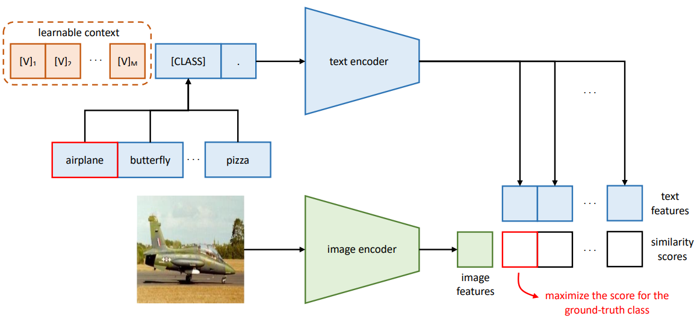

# Online Test-time Adaptation with CLIP-like models

This repository uses the models provided by [OpenCLIP](https://github.com/mlfoundations/open_clip).

## Unfold the full potential of this repository
In addition to the datasets described [here](../../README.md), 
we also support the following datasets, which are automatically downloaded via torchvision. 
Please note that some of these datasets may fail to download automatically and will therefore require manual download.

- `caltech101` [Caltech101](http://www.vision.caltech.edu/Image_Datasets/Caltech101/101_ObjectCategories.tar.gz)
- `dtd` [DTD](https://www.robots.ox.ac.uk/~vgg/data/dtd/download/dtd-r1.0.1.tar.gz)
- `eurosat` [EuroSAT](http://madm.dfki.de/files/sentinel/EuroSAT.zip) (automatic download via torchvision fails)
- `fgvc_aircraft` [FGVCAircraft](https://www.robots.ox.ac.uk/~vgg/data/fgvc-aircraft/archives/fgvc-aircraft-2013b.tar.gz)
- `flowers102` [Flowers102](https://www.robots.ox.ac.uk/~vgg/data/flowers/102/102flowers.tgz)
- `food101` [Food101](http://data.vision.ee.ethz.ch/cvl/food-101.tar.gz)
- `oxford_pets` [OxfordPets](https://www.robots.ox.ac.uk/~vgg/data/pets/data/images.tar.gz)
- `stanford_cars` [StanfordCars](https://ai.stanford.edu/~jkrause/cars/car_dataset.html)    (automatic download via torchvision fails)
- `sun397` [SUN397](http://vision.princeton.edu/projects/2010/SUN/SUN397.tar.gz) (automatic download via torchvision fails)
- `ucf101` [UCF101](https://drive.google.com/file/d/10Jqome3vtUA2keJkNanAiFpgbyC9Hc2O/view?usp=sharing) (automatic download via torchvision fails)

Since we adopt the same data splits as [CoOp](https://arxiv.org/abs/2109.01134), you can also refer to 
[this page](https://github.com/KaiyangZhou/CoOp/blob/main/DATASETS.md#how-to-install-datasets) to setup the datasets.
Note that we already downloaded the corresponding split files and put them under `datasets/other_lists`. After downloading the missing datasets, you may need to adapt the path to the root directory `_C.DATA_DIR = "./data"` 
located in the file `conf.py`. For the individual datasets, the directory names are specified in `conf.py` as a dictionary
within the function `complete_data_dir_path`. In case your directory names deviate from the ones specified in the mapping dictionary, you can simply change them. 

## Approach of CLIP
In the pre-training stage of [CLIP](https://arxiv.org/abs/2103.00020), contrastive learning is leveraged 
to align the representations of an image and its corresponding caption. The representations are extracted using a 
separate encoder for each modality. 
After pre-training the model on a large dataset consisting of millions of image-text pairs, zero-shot classification can be
performed. This typically involves extracting a text representation for each class using a phrase like `A photo of a {class_name}.`
and then calculate the similarities between the extracted text representations and the image representation. 
The final prediction simply corresponds to the class with the highest similarity score.  
|  |
|:--:|
| Image Credit: https://github.com/openai/CLIP |

In practice, the text representations for zero-shot classification can be extracted once before inference, which then
significantly reduces the computational overhead, as only the image representations need to be computed.

To perform zero-shot classification on ImageNet-R with CLIP and a `ViT-B-16` model pre-trained with weights from OpenAI,
simply run the following line of code
```bash
python test_time.py --cfg cfgs/imagenet_others/source.yaml CORRUPTION.DATASET imagenet_r MODEL.USE_CLIP True MODEL.ARCH ViT-B-16 MODEL.WEIGHTS openai CLIP.PROMPT_MODE custom CLIP.PROMPT_TEMPLATE "['a photo of a {}.']"
```
This will result in an error rate of 26.05% on ImageNet-R. If you are interested in other models and
pre-trained weights, simply change the arguments for `MODEL.ARCH` and `MODEL.WEIGHTS`. 
You can retrieve the full list of supported models and weights via
```python
import open_clip
open_clip.list_pretrained()
```
OpenCLIP also provides an overview of the models and pre-trained weights [here](https://github.com/mlfoundations/open_clip/blob/main/docs/openclip_results.csv). 


## Improving the performance

### Writing a better handcrafted prompt
While using a simple phrase like `a photo of a {class_name}.` can 
already work exceptionally well, the classification performance heavily depends on the prompt. In many applications, writing better handcrafted prompts can significantly
boost the performance of your model. 
In case of ImageNet-R, using `CLIP.PROMPT_TEMPLATE "['depiction of a {}.']"` decreases the error rate from 26.05% to 23.60%
If your dataset consists of low resolution satellite photos of different classes (like in EuroSAT),
using a prompt like `a blurry satellite photo of {class_name}.` decreases the error rate
from 58.59% to 46.30%. This demonstrates the usefulness of good prompts.
```bash
python test_time.py --cfg cfgs/imagenet_others/source.yaml CORRUPTION.DATASET eurosat MODEL.USE_CLIP True MODEL.ARCH ViT-B-16 MODEL.WEIGHTS openai CLIP.PROMPT_MODE custom CLIP.PROMPT_TEMPLATE "['a blurry satellite photo of {}.']"
```

### Prompt ensembles
Instead of using a single prompt template such as `a photo of a {class_name}.`, 
[CLIP](https://arxiv.org/abs/2103.00020) also proposed to use a list of multiple templates. 
An example can look like the following list 
`[a photo of a {class_name}, a sketch of a {class_name}, a painting of a {class_name}]`.
This procedure allows to create an ensemble, which has been found to consistently improve the results.
While one may think that an ensemble consisting of 80 different prompt templates for each class (like for ImageNet)
will drastically increase the computational overhead, this is actually not the case. In fact, the
computational complexity during inference is the same as before. This is due to the circumstance
that the ensemble is created in the embedding space instead of the probability space. 

The procedure for a text-based ensemble in the embedding space looks as follows. Before inference do: 
1. Insert the class name `c_name` into the prompt list, i.e. `[a photo of a dog, a sketch of a dog, ...]`. 
2. forward the prompt list through the text encoder to get the text representations. 
3. Average all text representations containing the same class name to get a single mean representation for each class

Subsequently, zero-shot classification can be performed according to the procedure described above.

The prompt templates proposed by [CLIP](https://arxiv.org/abs/2103.00020) can be found [here](https://github.com/openai/CLIP/blob/main/data/prompts.md).
We already placed the prompt lists into the file located under `datasets/prompts.py`. 
To perform zero-shot classification on ImageNet-R using an ensemble, just specify `CLIP.PROMPT_MODE ensemble` 
or run the following line of code:
```bash
python test_time.py --cfg cfgs/imagenet_others/source.yaml MODEL.USE_CLIP True MODEL.ARCH ViT-B-16 MODEL.WEIGHTS openai CLIP.PROMPT_MODE ensemble
```
This will result in an error rate of 22.42%

### Customized Prompts via Language models (CuPL)
While the previously described ensemble approach uses a list of typically handcrafted prompt templates,
[CuPL](https://arxiv.org/abs/2209.03320) proposed to generate the list of prompts used for each class with 
a large language model (LLM). Specifically, the LLM is asked to write 
"descriptive sentences that contain important discriminating characteristics of the image categories". In case of the
category *goldfish*, the prompt list may look like this: `["Most goldfish have a shiny gold or orange color.", "A goldfish in a bowl.", ...]`
You can find all prompts generated with CuPL [here](https://github.com/sarahpratt/CuPL). We only support CuPL with
the ImageNet based datasets. The corresponding prompts can be found [here](../datasets/cupl_prompts/CuPL_ImageNet_prompts.json).
To run CuPL on ImageNet-R, simply execute the following line of code
```bash
python test_time.py --cfg cfgs/imagenet_others/source.yaml MODEL.USE_CLIP True MODEL.ARCH ViT-B-16 MODEL.WEIGHTS openai CLIP.PROMPT_MODE cupl CLIP.PROMPT_PATH datasets/cupl_prompts/CuPL_ImageNet_prompts.json
```
This will result in an error rate of 22.92%. Note that you can also use the CuPL prompts
and the ensemble prompts together (i.e. concatenate the two lists). To do this, simply specify 
`CLIP.PROMPT_MODE all_prompts`.  


### Context Optimization (CoOp) and Test-time Prompt Tuning (TPT)
[CoOp](https://arxiv.org/abs/2109.01134) introduced context optimization, where the context of the 
prompt is learnable instead of being fixed or manually tuned (in the examples above, the context corresponds to `a photo of a`).

|  |
|:--:|
| Image Credit: https://arxiv.org/abs/2109.01134 |

Building upon this idea, [TPT](https://arxiv.org/abs/2209.07511) proposed to use context optimization
during test-time. The procedure involves using test-time augmentation to create a batch of 64 samples 
from a single test image. Then, the most certain 10% of samples in terms of entropy are selected to minimize 
an entropy loss with respect to the trainable context parameters. After the context is updated one (or several) times,
regular zero-shot classification can be performed. While the authors demonstrate the effectiveness
of this approach, the computational overhead is huge as for each test image, there are 64 forward passes 
through the image encoder and at least 2 forward passes through the text encoder - one needed to update the context and another
to get the updated text representations).
To run TPT on ImageNet-R, simply execute the following line of code
```bash
python test_time.py --cfg cfgs/imagenet_others/tpt.yaml MODEL.USE_CLIP True MODEL.ARCH ViT-B-16 MODEL.WEIGHTS openai
```
This will result in an error rate of 23.0%

Finally, in our [paper](https://arxiv.org/abs/2405.14977), we introduced Vision-Text-Space Ensemble (VTE), which creates an ensemble
in the image and text space. To run VTE, simply execute the following line of code
```bash
python test_time.py --cfg cfgs/imagenet_others/vte.yaml MODEL.USE_CLIP True MODEL.ARCH ViT-B-16 MODEL.WEIGHTS openai
```
This will result in an error rate of 19.6% on ImageNet-R.


### Combining TTA methods for classification with CLIP

This repository also supports the combination of the various settings, datasets, and methods described [here](../../README.md) 
with image-text models like CLIP. For instance, you can test the performance of ROID on ImageNet-R with CLIP and 
a `ViT-B-16` model pre-trained with weights from OpenAI, by running the following line of code
```bash
python test_time.py --cfg cfgs/imagenet_others/roid.yaml MODEL.USE_CLIP True MODEL.ARCH ViT-B-16 MODEL.WEIGHTS openai CLIP.FREEZE_TEXT_ENCODER True
```
By specifying `CLIP.FREEZE_TEXT_ENCODER True`, only the weights of the image encoder will be trained by ROID, while the
weights of the text encoder are frozen. To further improve the performance, it is also possible to use prompt ensembling,
 CuPL prompts or even the combined lists. This simply requires specifying `CLIP.PROMPT_MODE` to one of the following
`[ensemble, cupl, all_prompts]`. You can also run the following code to combine ROID with the handcrafted ensemble
```bash
python test_time.py --cfg cfgs/imagenet_others/roid.yaml MODEL.USE_CLIP True MODEL.ARCH ViT-B-16 MODEL.WEIGHTS openai CLIP.FREEZE_TEXT_ENCODER True CLIP.PROMPT_MODE ensemble 
```

## Benchmark
A detailed comparison of the aforementioned methods for different datasets and models can be found in [our paper](https://arxiv.org/abs/2405.14977)


## Star or Citation
If you found this repository useful, please consider leaving a star :star: or cite

```
@inproceedings{dobler2023robust,
  title={Robust mean teacher for continual and gradual test-time adaptation},
  author={D{\"o}bler, Mario and Marsden, Robert A and Yang, Bin},
  booktitle={Proceedings of the IEEE/CVF Conference on Computer Vision and Pattern Recognition},
  pages={7704--7714},
  year={2023}
}
```

```
@inproceedings{marsden2024universal,
  title={Universal Test-time Adaptation through Weight Ensembling, Diversity Weighting, and Prior Correction},
  author={Marsden, Robert A and D{\"o}bler, Mario and Yang, Bin},
  booktitle={Proceedings of the IEEE/CVF Winter Conference on Applications of Computer Vision},
  pages={2555--2565},
  year={2024}
}
```

```
@article{dobler2024lost,
  title={A Lost Opportunity for Vision-Language Models: A Comparative Study of Online Test-time Adaptation for Vision-Language Models},
  author={D{\"o}bler, Mario and Marsden, Robert A and Raichle, Tobias and Yang, Bin},
  journal={arXiv preprint arXiv:2405.14977},
  year={2024}
}
```
